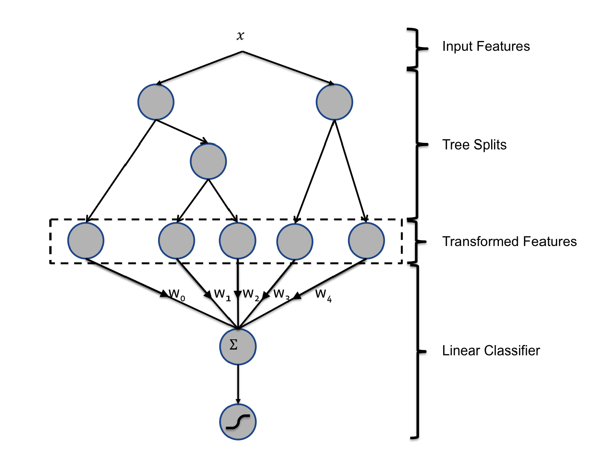
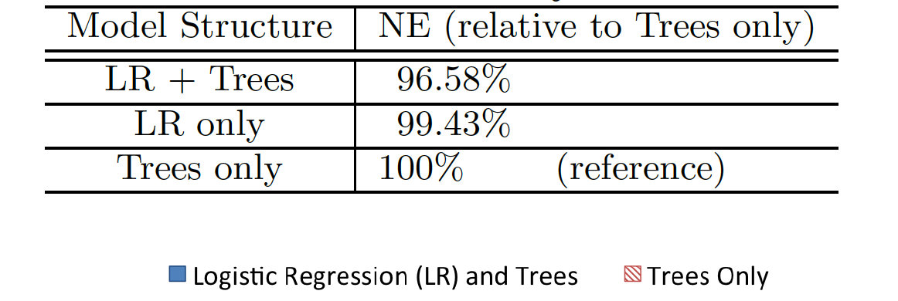
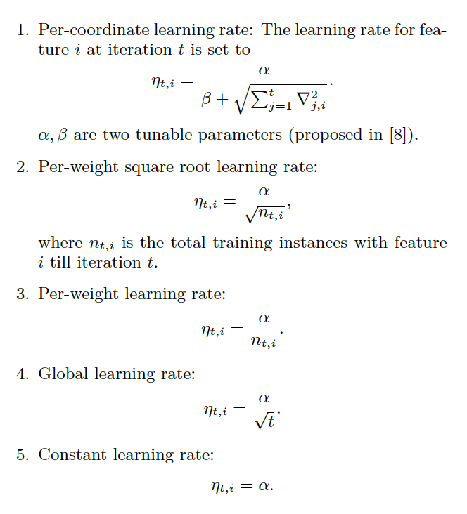
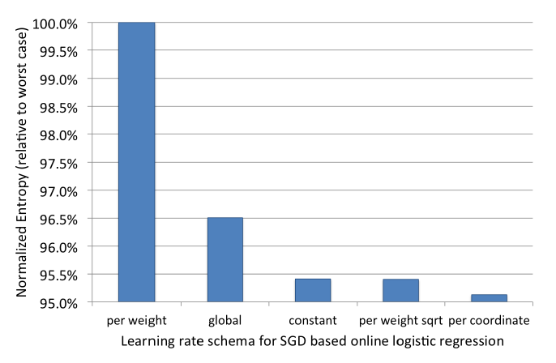
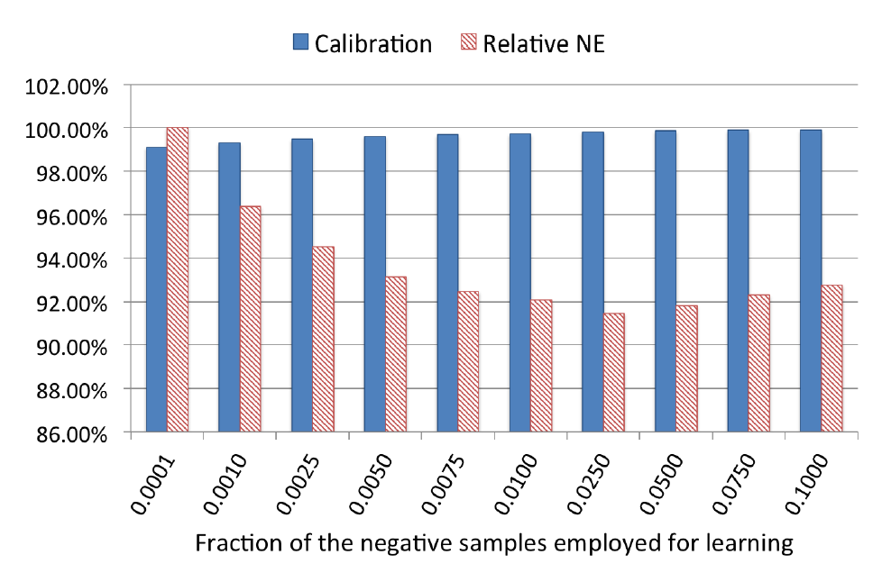

# Practical lessons from Predicting Clicks on Ads at Facebook

## Abstract

1. facebook采用结合GBDT和LR的模型预估CTR, 效果相对于单个模型高出3%
2. 作者研究了对整体系统产生主要影响的几个因素，结论是最重要的因素是那些**刻画用户或者广告历史信息的特征**和**正确的模型(GBDT+LR)**，其他的因素影响都很小

## 1. Intro

- facebook是展示广告，广告系统是由级联的一系列分类器组成，这篇文章介绍的CTR模型是最后一个环节

## 2. Experimental setup

- Normalized Entropy(NE): 每次展现时预测得到的log loss的平均值，除以整个数据集实际CTR的熵。归一化主要是为了实际CTR不同的数据集可以对比。

$$
NE = \frac
{-\frac{1}{N} \sum_{i=1}^n (\frac{1+y_i}{2}\log(p_i) + \frac{1-y_i}{2}\log(1-p_i))}
{-(p*\log(p)+(1-p)*\log(1-p))}
$$

- Calibration: 预估CTR除以实际CTR，越接近1表明效果越好

$$
Calibration = \frac {\text{average estimated CTR} } { \text{empirical CTR}}  =
 \frac {\text{#expected_clicks}} {\text{#observed_clicks}} 
$$

## 3. Prediction model structure

作者使用两种Online Learning的方法

- SGD-based LR

$$
s(y,\mathbf{x},\mathbf{w}) = y \cdot \mathbf{w}^T\mathbf{x}
$$

$$
p(y|\mathbf{x},\mathbf{w}) = sigmoid(s(y,\mathbf{x},\mathbf{w}))
$$

​	模型更新

$$
w_{i_j} \gets w_{i_j} + y \cdot \eta_{i_j} \cdot g(s(y,\mathbf{x},\mathbf{w}))
$$

$$
g(s) := [y(y+1)/2 - y \cdot sigmoid(s)]
$$

- BOPR (Bayesian online probit regression)

$$
p(y|\mathbf{x},\mathbf{w}) = \Phi (\frac {s(y,\mathbf{x},\mathbf{w})}{\beta})
$$

$$
p(\mathbf{w}) = \prod_{k=1}^N N(w_k; \mu_k, \sigma_k^2)
$$

​	模型更新

$$
\mu_{i_j} \leftarrow \mu_{i_j} + y \cdot \frac{\sigma_{i_j}^2}{\Sigma}
   \cdot v \bigg(\frac{s(y,\mathbf{x},\mathbf{\mu})}{\Sigma} \bigg)
$$

$$
\sigma_{i_j} \leftarrow \sigma_{i_j} \cdot \bigg[ 1 - \frac{\sigma_{i_j}^2}{\Sigma}
   \cdot w \bigg(\frac{s(y,\mathbf{x},\mathbf{\mu})}{\Sigma} \bigg) \bigg]
$$

$$
\Sigma^2 = \beta^2 + \sum_{j=1}^n \sigma_{i_j}^2
$$

### 3.1 Decision tree feature transforms

- 线性模型表达能力不够
    - 连续值特征离散化-bin
    - 特征组合
- GBDT可以作为一种很好的特征非线性转换和特征组合工具，把GBDT的每棵树作为一个类别特征，instance落入的叶结点就是这个特征的取值。
- 基于GBDT的特征转换，可以看作是一种有监督的特征编码, 将连续值特征转换成紧凑的binary-valued向量。从根结点到某个叶结点的遍历可以看作是在某些特征上的分类规则。 那么进而对这些转化后的特征训练的线性模型可以是看做是学习这些规则的权重。

- 效果

### 3.2 Data freshness

- 训练数据越新效果越好，使用前一天的数据训练模型比一周前的一天数据训练模型NE下降1%

### 3.3 Online linear classifier

- 比较不同的SGD-based LR的learning rate的设置方法
    
    
    - pre coordinate借鉴了FTRL中的方法，某个维度的变化的快，那么这个维度的学习率应该下降得更快，使用这一维的梯度值表示变化快慢
    - global效果差，因为在不同特征上的训练数据不平衡, 训练数据少的特征上 learning rate下降太快了
    - per weight在所有特征上都下降太快了, 容易陷入次优

- BOPR实际上也是per coordinate的learning rate
    - per coordinate online LR和BOPR的效果非常接近

- 对比LR和BOPR
    - LR的优势是参数少，每个维度只有一个weight，而BOPR有一个均值和方差
    - LR在预测时计算速度快，只需要一次内积，BOPR需要两次内积
    - BOPR的优势是能得到完整的预测点击概率分布

## 4. Online data joiner

- 展现日志的等待窗口：需要在时效性和点击覆盖率之间寻求平衡
- 实现分布式的stream-to-stream join，实现上采用类似HashQueue，提供enqueue,dequeue,lookup接口
- 需要保护机制: 比如click stream因为系统原因日志延迟，那么会得到非常小的empirical CTR。可以采用异常检测，比如数据分布突变则自动断开joiner和online trainer.

## 5. Containing memory and latency
### 5.1 Number of boosting trees

- 限制每个棵树不能超过12个叶结点，500棵树之后NE不再下降
- 最后1000棵树对NE的降低贡献低于0.1%

### 5.2 Boosting feature importance

- GBDT特征重要性评估方法: 在每个树节点建立过程中，都是选择使得loss减少量最大化的特征值作为分裂点。某个特征可能在多个树的建立过程中使用，所以**重要性**指标定义为某个特征在所有树的建立过程中loss减少量之和。
- top10的特征贡献了将近一半的重要性
- 最后的300个特征一起只贡献了1%的特征重要性

### 5.3 Historical features

- GBDT中使用的特征可以分为两类: 上下文特征和历史性特征
    - 历史性特征是用户过去的行为。历史性特征起着至关重要的作用：top10全是历史性特征、在所有特征中历史性特征占75%重要性
    - 上下文特征对于解决冷启动至关重要。上下文特征更依赖数据的新鲜程度

## 6. Coping with massive training data
### 6.1 Uniform subsampling

- 100%的数据训练相对于10%的训练数据只能降低1%的NE

### 6.2 Negative down sampling

- 解决了类别不平均的问题
- 在实验数据熵0.025的负采样率获得效果最好，NE最小

### 6.3 Model Re-Calibration
- 重新调整 预估时

$$
q = \frac{p}{p+(1-p)/w}
$$

$w$是负采样率, $p$是预估CTR
